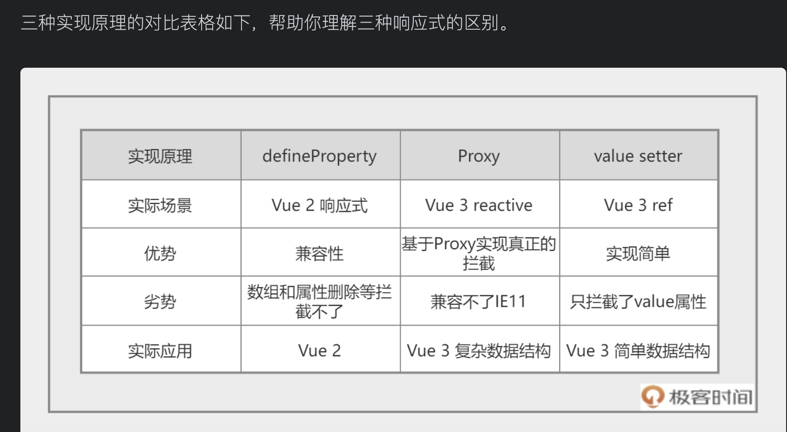

## 1. 对比



在 Vue 3 中还有另一个响应式实现的逻辑，就是利用对象的 get 和 set 函数来进行监听，这种响应式的实现方式，只能拦截某一个属性的修改，这也是 Vue 3 中 ref 这个 API 的实现。在下面的代码中，我们拦截了 count 的 value 属性，并且拦截了 set 操作，也能实现类似的功能。

```
let getDouble = n => n * 2
let _value = 1
double = getDouble(_value)
let count = {
  get value() {
    return _value
  },
  set value(val) {
    _value = val
    double = getDouble(_value)
  }
}
console.log(count.value,double)
count.value = 2
console.log(count.value,double)
```